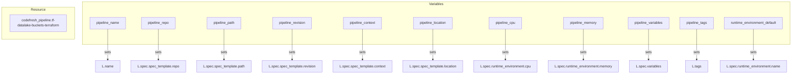
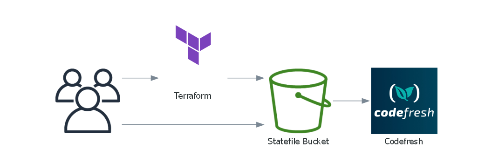

# Terraform Codefresh Pipeline Module

A Terraform module to manage [Codefresh](https://codefresh.io/) pipelines. This module allows you to define and configure Codefresh pipelines using Terraform, enabling Infrastructure as Code (IaC) practices for your CI/CD workflows.


[](https://github.com/Richard-Barrett/terraform-codefresh-pipeline/actions/workflows/iac-codeql.yaml)
[](https://github.com/Richard-Barrett/terraform-codefresh-pipeline/actions/workflows/terraform_validate.yaml)
[](https://github.com/Richard-Barrett/terraform-codefresh-pipeline/actions/workflows/tflint.yaml)
[](https://github.com/Richard-Barrett/terraform-codefresh-pipeline/actions/workflows/trivy.yaml)

<details>
<summary>Module Diagram</summary>



</details>

## CICD Implementations

An Example of a CICD Integration using Codefresh and BitBucket with this module can be found below:



## Usage

```hcl
module "codefresh_pipeline" {
  source = "git::https://github.com/Richard-Barrett/terraform-codefresh-pipeline.git?ref=0.2.0"

  pipeline_name               = "my-codefresh-pipeline"
  pipeline_repo               = "https://github.com/your-repo.git"
  pipeline_path               = "path/to/pipeline"
  pipeline_revision           = "main"
  pipeline_context            = "production"
  pipeline_location           = "us-west-2"
  pipeline_cpu                = "2"
  pipeline_memory             = "4Gi"
  runtime_environment_default = "default-env"

  pipeline_tags = [
    "prodsys-data",
    "ci-cd",
  ]

  pipeline_variables = {
    ENV_VAR1 = "value1"
    ENV_VAR2 = "value2"
  }
}

```

## Terraform Documentation

<!-- BEGIN_TF_DOCS -->
## Requirements

| Name | Version |
|------|---------|
| <a name="requirement_terraform"></a> [terraform](#requirement\_terraform) | >= 1.5.7 |
| <a name="requirement_codefresh"></a> [codefresh](#requirement\_codefresh) | 0.11.0 |

## Providers

| Name | Version |
|------|---------|
| <a name="provider_codefresh"></a> [codefresh](#provider\_codefresh) | 0.11.0 |

## Modules

No modules.

## Resources

| Name | Type |
|------|------|
| [codefresh_pipeline.tf-datalake-buckets-terraform](https://registry.terraform.io/providers/codefresh-io/codefresh/0.11.0/docs/resources/pipeline) | resource |

## Inputs

| Name | Description | Type | Default | Required |
|------|-------------|------|---------|:--------:|
| <a name="input_pipeline_context"></a> [pipeline\_context](#input\_pipeline\_context) | Context for the pipeline | `string` | n/a | yes |
| <a name="input_pipeline_cpu"></a> [pipeline\_cpu](#input\_pipeline\_cpu) | CPU allocation for the runtime environment | `string` | `2500` | no |
| <a name="input_pipeline_location"></a> [pipeline\_location](#input\_pipeline\_location) | Location of the pipeline repository | `string` | n/a | yes |
| <a name="input_pipeline_memory"></a> [pipeline\_memory](#input\_pipeline\_memory) | Memory allocation for the runtime environment (e.g., '512Mi', '2Gi') | `string` | `"512Mi"` | no |
| <a name="input_pipeline_name"></a> [pipeline\_name](#input\_pipeline\_name) | Name of the Codefresh pipeline | `string` | n/a | yes |
| <a name="input_pipeline_path"></a> [pipeline\_path](#input\_pipeline\_path) | Path to the pipeline configuration in the repository | `string` | n/a | yes |
| <a name="input_pipeline_repo"></a> [pipeline\_repo](#input\_pipeline\_repo) | Repository containing the pipeline configuration | `string` | n/a | yes |
| <a name="input_pipeline_revision"></a> [pipeline\_revision](#input\_pipeline\_revision) | Revision of the pipeline configuration to use | `string` | n/a | yes |
| <a name="input_pipeline_tags"></a> [pipeline\_tags](#input\_pipeline\_tags) | Tags to associate with the pipeline | `list(string)` | n/a | yes |
| <a name="input_pipeline_variables"></a> [pipeline\_variables](#input\_pipeline\_variables) | Environment variables for the pipeline | `map(string)` | n/a | yes |
| <a name="input_runtime_environment_default"></a> [runtime\_environment\_default](#input\_runtime\_environment\_default) | Default runtime environment name | `string` | n/a | yes |

## Outputs

| Name | Description |
|------|-------------|
| <a name="output_network_rule_id"></a> [network\_rule\_id](#output\_network\_rule\_id) | The ID of the network rule. |
| <a name="output_network_rule_name"></a> [network\_rule\_name](#output\_network\_rule\_name) | The name of the network rule. |
| <a name="output_network_rule_type"></a> [network\_rule\_type](#output\_network\_rule\_type) | The type of the network rule. |
<!-- END_TF_DOCS -->

## Licence

MIT License. See [LICENSE](https://github.com/Richard-Barrett/terraform-codefresh-pipeline/blob/main/LICENSE) for full details.
